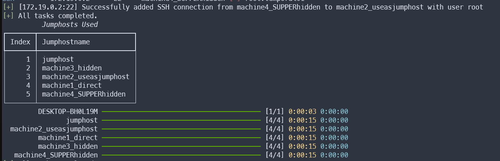
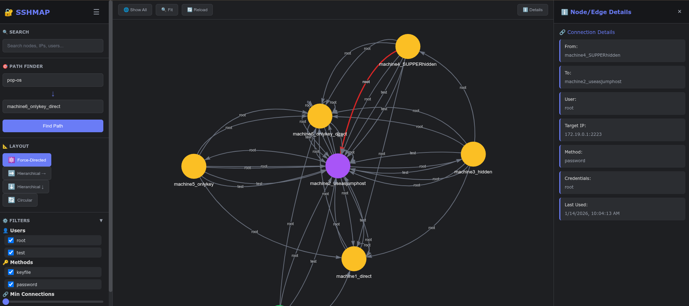

# SSHMAP Project

A modular Python tool for performing SSH bruteforce attacks, storing access relationships in a Neo4j graph.
There is a cli tool to get the paths from one starting point to other machines, and can creates que SSH commands to connect to the final machine.
```bash
 $ sshmap --help                                                                
usage: sshmap [-h] --targets TARGETS [--blacklist BLACKLIST] [--whitelist WHITELIST] [--force-targets FORCE_TARGETS] [--users USERS]
              [--passwords PASSWORDS] [--credentialspath CREDENTIALSPATH] [--keys KEYS] [--maxworkers MAXWORKERS]
              [--maxworkers-ssh MAXWORKERS_SSH] [--max-retries MAX_RETRIES] [--maxdepth MAXDEPTH] [--force-rescan] [--debug] [--verbose]
              [--log] [--log-file LOG_FILE] [--start-from START_FROM]

    ███████╗███████╗██╗  ██╗███╗   ███╗ █████╗ ██████╗
    ██╔════╝██╔════╝██║  ██║████╗ ████║██╔══██╗██╔══██╗
    ███████╗███████╗███████║██╔████╔██║███████║██████╔╝
    ╚════██║╚════██║██╔══██║██║╚██╔╝██║██╔══██║██╔═══╝
    ███████║███████║██║  ██║██║ ╚═╝ ██║██║  ██║██║
    ╚══════╝╚══════╝╚═╝  ╚═╝╚═╝     ╚═╝╚═╝  ╚═╝╚═╝

        SSH Credential Mapper - SSHMAP
        Navigating the Maze of Access...

        Version : 1.0.0


options:
  -h, --help            show this help message and exit
  --targets TARGETS     Path to the file with target IPs
  --blacklist BLACKLIST
                        Path to the file with IPs to ignore
  --whitelist WHITELIST
                        Path to the file with IPs or CIDRs that are the only IPs that can be scanned
  --force-targets FORCE_TARGETS
                        Path to the file with IPs or CIDRs that are the ONLY targets to scan (ignores whitelist/blacklist, uses same targets for recursive scans)
  --users USERS         Path to the file with usernames for bruteforce
  --passwords PASSWORDS
                        Path to the file with passwords for bruteforce
  --credentialspath CREDENTIALSPATH
                        Path to CSV credentials file, will populate users and passwords
  --keys KEYS           Path to directory with SSH private keys
  --maxworkers MAXWORKERS
                        Number of workers for concurrent IP attack
  --maxworkers-ssh MAXWORKERS_SSH
                        Number of workers for ssh user:password try
  --max-retries MAX_RETRIES
                        Maximum number of retries for transient connection failures
  --maxdepth MAXDEPTH   Max depth of the scan
  --force-rescan        Force retry of already-attempted connections (ignore attempt history)
  --debug               enable debug level information
  --verbose             enable verbose output
  --log                 enable logging to file
  --log-file LOG_FILE   Path to the log file
  --start-from START_FROM
                        Start scanning from a specific remote hostname (must exist in graphdb)

```
## Features
- SSH bruteforce with passwords and private keys
- Neo4j integration
- Standard Python logging
- Modular architecture
- Async scanning, fast as it can be
- CLI with argparse
- Smart connection tracking - skips already-attempted connections for faster subsequent runs
- Batched database writes for optimal performance with thousands of connection attempts
- Start scanning from any discovered remote host with `--start-from` option
- **Web-based graph visualization interface** - Explore your SSH network topology with an intuitive web UI
- **Modular post-exploitation tool** - Run automated post-exploitation modules on discovered hosts (credential harvesting, system info, LinPEAS)

## Screenshots
Attacking just one machine, and using it as a jump host:


End of the scan:


## Setup

### Install with pipx (recommended)
You can install SSHMAP system-wide using pipx. This will create the `sshmap` command and isolate dependencies.

From GitHub:
```bash
pipx install git+https://github.com/derekkddj/SSHMAP.git
```

From a local clone (inside the repo folder):
```bash
pipx install .
```

Verify and see options:
```bash
sshmap --help
```

### Prepare Wordlists

- wordlists/users.txt

- wordlists/passwords.txt

- wordlists/keys/ (SSH private keys)

### Configure Neo4j
Create a file in **~/.sshmap/config.yml**

It must contains the following config:
```YAML
# config.yml

# Neo4j database connection
neo4j_uri: "bolt://localhost:7687"
neo4j_user: "neo4j"
neo4j_pass: "neo4j"
max_mask: 24

# SSH scanning
ssh_ports: [22,2222,2223]        # List of ports to scan
max_depth: 1 #default max depth
# Optional settings
scan_timeout: 5        # Timeout for SSH connection attempts (in seconds)
brute_new_credential: False # If True, every new credential will be saved as _bruteforce, so it will be used in next host regadless of the IP
record_connection_attempts: True # If True, records all connection attempts (successful and failed) to Neo4j for tracking. Set to False for faster scans with thousands of attempts.
```

### Usage

First run the Neo4J server, the easiest way is with docker:
```bash
docker run --env=NEO4J_AUTH=none --publish=7474:7474 --publish=7687:7687 --volume=$HOME/neo4j/data:/data -e NEO4J_apoc_export_file_enabled=true -e NEO4J_apoc_import_file_enabled=true -e NEO4J_apoc_import_file_use__neo4j__config=true -e NEO4JLABS_PLUGINS=\[\"apoc\"\] neo4j
```

#### Windows problem

Maybe in windows you need to place the plugin manually and run the docker with:
```bash
docker run `
  --env NEO4J_AUTH=none `
  --env NEO4J_apoc_export_file_enabled=true `
  --env NEO4J_apoc_import_file_enabled=true `
  --env NEO4J_apoc_import_file_use__neo4j__config=true `
  --publish=7474:7474 --publish=7687:7687 `
  --volume=${HOME}/neo4j/data:/data `
  --volume=C:\neo4j\plugins:/plugins `
  neo4j

```

You should put the plugin in *C:\neo4j\plugins*, download it from [Github APOC](https://github.com/neo4j/apoc/releases)

### RUN scanner

Then run the program from your starting host.
```bash
$ sshmap --targets wordlists/ips.txt --users wordlists/usernames.txt --passwords wordlists/passwords.txt --keys wordlists/keys/
```

#### Starting from a Remote Host

SSHMAP supports starting the scan from any previously discovered remote host using the `--start-from` option. This is useful when you want to continue scanning from a specific machine in your network map.

**How it works:**
- Looks up the specified hostname in the Neo4j graph database
- Uses `SSHSessionManager` to establish an SSH connection to that remote host
- Starts scanning targets from that remote host instead of your local machine

**Example usage:**
```bash
# First, run an initial scan to discover some hosts
$ sshmap --targets wordlists/ips.txt --users wordlists/usernames.txt --passwords wordlists/passwords.txt --keys wordlists/keys/

# Later, start scanning from a discovered remote host
$ sshmap --targets wordlists/new_targets.txt --users wordlists/usernames.txt --passwords wordlists/passwords.txt --keys wordlists/keys/ --start-from machine2_useasjumphost

# The scan will now originate from machine2_useasjumphost instead of your local machine
```

**Use cases:**
- **Pivot scanning**: Start scanning from a compromised host that has access to a different network segment
- **Distributed scanning**: Continue scanning from various points in your network map
- **Targeted scanning**: Focus on discovering hosts reachable from a specific machine

**Requirements:**
- The remote host must already exist in the graph database (discovered in a previous scan)
- There must be a valid path from your local machine to the remote host
- Valid credentials must be available to connect to the remote host

#### Smart Connection Tracking

SSHMAP now tracks all connection attempts in sqlite and automatically skips already-attempted connections, significantly reducing scan time on subsequent runs.

**How it works:**
- Tracks each connection attempt: `from_host → to_host` with specific credentials (user, method, password/key)
- New credentials are automatically tried from **all known hosts** to **all targets**
- Each unique combination is only attempted once (unless `--force-rescan` is used)

**First run:**
```bash
$ sshmap --targets wordlists/ips.txt --users wordlists/usernames.txt --passwords wordlists/passwords.txt --keys wordlists/keys/
# All connection attempts are made and recorded in Neo4j
```

**Subsequent runs with new credentials:**
```bash
# Add new credentials to your wordlists
$ sshmap--targets wordlists/ips.txt --users wordlists/usernames.txt --passwords wordlists/passwords.txt --keys wordlists/keys/
# Only new credential combinations are tried - already-attempted connections are automatically skipped
# Output: "[OPTIMIZATION] Skipping N already-attempted credentials for host:port from source"
# If no new connections found, previous successful connections are automatically re-used
# Output: "[FALLBACK] Re-using previous connection: source -> target"
```

**How the fallback mechanism works:**
When you add new credentials and run a second scan:
1. **Load previous connections**: At the start of bruteforce, loads all previous successful connections from the current host to the target
2. **Try new credentials**: Attempts all new credentials on the target
3. **Track successful reconnections**: When a new connection succeeds to a target that had a previous connection, marks that old connection as replaced
4. **Re-establish remaining connections**: After trying all new credentials, re-establishes any previous connections that weren't replaced

This ensures that:
- New credentials are tried at every level of the network
- **All** previously discovered paths are maintained, not just one
- If a host has connections to multiple targets, and only some connections are re-established with new credentials, the others are still maintained
- Works recursively at any depth (machine1 → machine2 → machine3 → machine4...)

**Example scenario (single path):**
- First run discovers: `machine1 → machine2 → machine3 → machine4` (with old credentials)
- You add credential `test:test123` that only works on `machine3 → machine4`
- Second run: 
  - Tries `test:test123` from machine1 to machine2 → fails
  - Fallback: Re-uses previous connection machine1 → machine2 with old credentials
  - Tries `test:test123` from machine2 to machine3 → fails
  - Fallback: Re-uses previous connection machine2 → machine3 with old credentials
  - Tries `test:test123` from machine3 to machine4 → succeeds! 

**Example scenario (multiple paths):**
- First run discovers: `machine2 → machine3` and `machine2 → machine4` (with old credentials)
- You add credential `test:test123` that only works on machine3
- Second run from machine2:
  - Tries `test:test123` to machine3 → succeeds! (new connection found)
  - Tries `test:test123` to machine4 → fails
  - Fallback: Re-uses previous connection machine2 → machine4 with old credentials
  - Both paths are maintained, allowing continued scanning from both machine3 and machine4

**Force retry all connections:**
```bash
$ sshmap --targets wordlists/ips.txt --users wordlists/usernames.txt --passwords wordlists/passwords.txt --keys wordlists/keys/ --force-rescan
# Retries all connection attempts, including previously attempted ones
```


### View the graph in the Neo4J console:

Firts go to http://localhost:7474/browser/preview/ and browse the data.


### Use the Web Interface (Recommended):

SSHMAP now includes a web-based interface for exploring your SSH connection graph with an intuitive GUI! 

**Start the web server:**
```bash
$ sshmap-web
```

Then open your browser and navigate to: **http://127.0.0.1:5000**



**Features:**
- **Interactive Graph Visualization** - See all your SSH connections in a dynamic, interactive network graph
- **Search Functionality** - Find nodes and connections by hostname, IP, user, or port
- **Path Finder** - Discover routes between any two hosts in your network
- **Statistics Dashboard** - View network statistics at a glance
- **Node & Edge Details** - Click on any node or connection to see detailed information
- **Autocomplete** - Easy hostname selection with autocomplete suggestions

The web interface provides a much more intuitive way to explore and understand your SSH network topology compared to the Neo4j browser interface.

**Note:** The web interface runs on localhost only (127.0.0.1) and does not include authentication, as it's designed for local exploration only.

### Use the included CLI:

There is a simple cli with its owns options. This tool is used to find paths between two nodes and to generate automatic SSH configurations to connect.
```bash
$ sshmap-cli --help
usage: sshmap_cli.py [-h] [--all] [--max-depth MAX_DEPTH] [--write-config] [--method {proxyjump,proxycommand}] start end

SSH Path Visualizer

positional arguments:
  start                 Starting hostname
  end                   Target hostname

options:
  -h, --help            show this help message and exit
  --all                 Show all paths (default: only one)
  --max-depth MAX_DEPTH
                        Max path depth (for --all)
  --write-config        Write SSH config file to /tmp
  --method {proxyjump,proxycommand}
                        SSH config method
```

Example of finding the path from node A to node B:
```bash
$ sshmap-cli DESKTOP-BH0L19M machine4_SUPPERhidden                                                                                                               
╭───────────── Shortest SSH Path ─────────────╮
│ DESKTOP-BH0L19M ──▶ machine2_useasjumphost  │
│ user: root   method: password   creds: root │
│ IP: 192.168.20.118   port: 2223             │
│                                             │
│ machine2_useasjumphost ──▶ machine3_hidden  │
│ user: root   method: password   creds: root │
│ IP: 172.19.0.3   port: 22                   │
│                                             │
│ machine3_hidden ──▶ machine4_SUPPERhidden   │
│ user: root   method: password   creds: root │
│ IP: 172.19.0.4   port: 22                   │
╰─────────────────────────────────────────────╯
```
Example of generate the configuration file for SSH:
```bash
$ sshmap-cli --write-config DESKTOP-BH0L19M machine4_SUPPERhidden                                                                                 
╭───────────── Shortest SSH Path ─────────────╮
│ DESKTOP-BH0L19M ──▶ machine2_useasjumphost  │
│ user: root   method: password   creds: root │
│ IP: 192.168.20.118   port: 2223             │
│                                             │
│ machine2_useasjumphost ──▶ machine3_hidden  │
│ user: root   method: password   creds: root │
│ IP: 172.19.0.3   port: 22                   │
│                                             │
│ machine3_hidden ──▶ machine4_SUPPERhidden   │
│ user: root   method: password   creds: root │
│ IP: 172.19.0.4   port: 22                   │
╰─────────────────────────────────────────────╯
[+] SSH config written to /tmp/sshmap_config
[+] Use it with: ssh -F /tmp/sshmap_config target
SSH config written to /tmp/sshmap_config
Usage: ssh -F /tmp/sshmap_config target
```
And now youu can check the contents of the file:
```bash
$ cat /tmp/sshmap_config target
Host jump0
    HostName 192.168.20.118
    User root
    Port 2223

Host jump1
    HostName 172.19.0.3
    User root
    Port 22

Host jump2
    HostName 172.19.0.4
    User root
    Port 22

Host target
    HostName 172.19.0.4
    User root
    Port 22
    ProxyJump jump0 jump1 jump2
```

When using this config file with SSH, you may need to write the passwords one by one for each JumpHost.

### Use the included "execute":

This is a simple program to execute commands on the machines found with the SSHMAP.py principal program.
The help shows all the info needed. This program uses the class SSHSessionManager to create and reuse SSH connections.

```bash
sshmap-execute --help                                                                                     
usage: sshmap_execute.py [-h] [--hostname HOSTNAME] [--command COMMAND] [--all] [--credentialspath CREDENTIALSPATH] [--debug] [--verbose]
                         [--maxworkers MAXWORKERS] [--output OUTPUT] [--quiet] [--no-store]

SSH Execute

options:
  -h, --help            show this help message and exit
  --hostname HOSTNAME   Hostname to execute commands on
  --command COMMAND     Command to execute
  --all                 Execute on all reachable hosts (default: only one)
  --credentialspath CREDENTIALSPATH
                        Path to CSV credentials file, will populate users and passwords
  --debug               enable debug level information
  --verbose             enable verbose output
  --maxworkers MAXWORKERS
                        Number of workers for target
  --output OUTPUT       Path to output folder
  --quiet               Suppress all output of command execution
  --no-store            Do not store the output to a file

```

### Use the Post-Exploitation Tool:

SSHMAP includes `sshmap-post`, a modular post-exploitation tool that runs on remote hosts discovered by the main scanner. It operates independently and does not interfere with the scanning process.

**Available Modules:**
- **credential_harvester** - Searches for credentials in shell history, SSH keys, config files (.netrc, .my.cnf, etc.), and common credential locations
- **system_info** - Gathers comprehensive system information (OS, network, users, processes, packages, etc.)
- **linpeas** - Downloads and executes LinPEAS for privilege escalation enumeration

**List available modules:**
```bash
$ sshmap-post --list
```

**Run a specific module on a single host:**
```bash
$ sshmap-post --hostname machine2_useasjumphost --module credential_harvester
```

**Run all modules on a single host:**
```bash
$ sshmap-post --hostname machine2_useasjumphost --all-modules
```

**Run a specific module on all discovered hosts:**
```bash
$ sshmap-post --all --module system_info
```

**Run all modules on all discovered hosts:**
```bash
$ sshmap-post --all --all-modules
```

**Options:**
```bash
usage: sshmap_post.py [-h] [--hostname HOSTNAME] [--all] [--module MODULE] 
                      [--all-modules] [--list] [--credentialspath CREDENTIALSPATH] 
                      [--output OUTPUT] [--debug] [--verbose]

options:
  --hostname HOSTNAME   Target hostname to run post-exploitation on
  --all                 Run on all reachable hosts in the graph database
  --module MODULE       Specific module to run (use --list to see available modules)
  --all-modules         Run all available post-exploitation modules
  --list                List all available post-exploitation modules and exit
  --credentialspath CREDENTIALSPATH
                        Path to CSV credentials file (default: wordlists/credentials.csv)
  --output OUTPUT       Base output directory for results (default: output)
  --debug               Enable debug level logging
  --verbose             Enable verbose output
```

**Output:**
All module results are saved to timestamped directories under `output/post_exploitation_<timestamp>/`:
- Credential files: `<hostname>_home_.bash_history`, `<hostname>_home_.ssh_config`, etc.
- System info: `<hostname>_system_info.txt`
- LinPEAS output: `<hostname>_linpeas.txt`

**Creating Custom Modules:**
The post-exploitation system is modular and extensible. To create a new module:

1. Create a new Python file in `modules/post_exploitation/modules/`
2. Inherit from `BasePostExploitationModule`
3. Implement the required properties (`name`, `description`) and `execute()` method
4. The module will be automatically discovered and registered

Example module structure:
```python
from modules.post_exploitation.base_module import BasePostExploitationModule

class MyCustomModule(BasePostExploitationModule):
    @property
    def name(self) -> str:
        return "my_module"
    
    @property
    def description(self) -> str:
        return "Description of what my module does"
    
    async def execute(self, ssh_session, output_dir: str) -> Dict[str, Any]:
        # Your module logic here
        hostname = await ssh_session.get_remote_hostname()
        output = await ssh_session.exec_command("your_command")
        # Save results and return status
        return {"success": True, "hostname": hostname, "data": output, "error": None}
```

### Project Structure
```bash
SSHMAP/
├── SSHMAP.py             # Main program to scan the network
├── sshmap_cli.py         # Simple CLI to find paths in the Neo4j database
├── sshmap_execute.py     # Simple CLI to execute commands in targets, using SSHSessionManager
├── sshmap_post.py        # Post-exploitation tool with modular system
├── sshmap_web.py         # Web interface launcher
├── web_app.py            # Flask web application with REST API
├── setup.py              # Package configuration and CLI entry points
├── requirements.txt      # Python dependencies
├── modules/              # Internal modules
│   ├── __init__.py
│   ├── bruteforce.py     # SSH brute force logic
│   ├── graphdb.py        # Neo4j wrapper
│   ├── key_scanner.py    # Remote SSH key search
│   ├── config.py         # Configuration management
│   ├── console.py        # Auxiliary functions for logging
│   ├── credential_store.py # Found credentials manager
│   ├── logger.py         # Logger setup
│   ├── paths.py          # Helper class for managing store paths
│   ├── SSHSession.py     # Wrapper for SSH connection with jump host info
│   ├── SSHSessionManager.py # Manager of SSHSessions (create, save, and reuse)
│   ├── utils.py          # Utility functions
│   ├── attempt_store.py  # Connection attempt tracking (SQLite)
│   ├── post_exploitation/ # Post-exploitation module system
│   │   ├── __init__.py
│   │   ├── base_module.py     # Base class for post-exploitation modules
│   │   ├── module_registry.py # Automatic module discovery and loading
│   │   └── modules/           # Post-exploitation modules
│   │       ├── credential_harvester.py # Credential harvesting module
│   │       ├── system_info.py         # System information gathering
│   │       └── linpeas.py             # LinPEAS execution module
│   └── helpers/          # Helper modules
│       ├── AsyncRandomQueue.py
│       └── logger.py
├── static/               # Web interface static files
│   ├── css/
│   │   └── style.css     # Dark theme styles
│   └── js/
│       └── app.js        # Graph visualization and UI logic
├── templates/            # Web interface templates
│   └── index.html        # Main web interface HTML
├── tests/                # Test suite
│   ├── conftest.py
│   ├── docker-compose.yaml
│   ├── test_*.py         # Various test files
│   └── ...
├── wordlists/            # Sample wordlists
│   ├── users.txt
│   ├── passwords.txt
│   ├── ips.txt
│   ├── blacklist.txt
│   ├── credentials.csv
│   └── keys/             # SSH private keys directory
├── examples/             # Example scripts
│   └── api_usage_example.py
├── docs/                 # Documentation
│   └── media/            # Screenshots and media files
├── output/               # Command execution output files
└── logs/                 # Execution logs (JSONL format)
```
### Future Work

- [x] Progress bars
- [ ] Create a key_scanner, or credential_scanner, to search in new machines
- [ ] Create POST-Explotation modules, like launch linpeas or linux exploit suggester
- [x] Better clean stop after Ctrl-C
- [x] Session manager, to close and create SSH tunnels bettter
- [x] Timestamt de los intentos realizados, en el fichero de log
