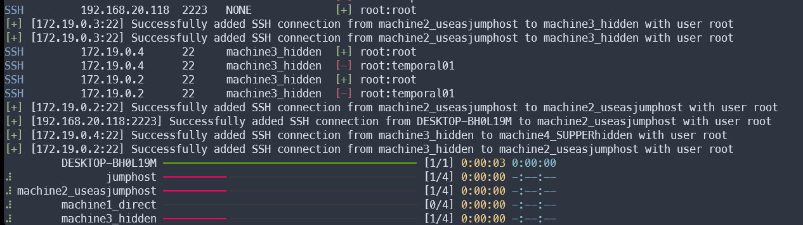
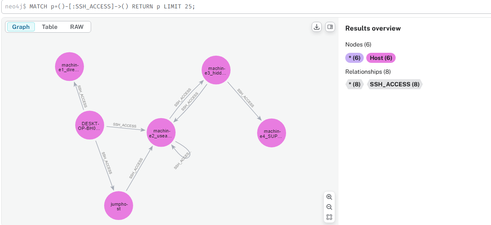

# SSH Brute Project

A modular Python tool for performing SSH bruteforce attacks, storing access relationships in a Neo4j graph.
There is a cli tool to get the paths from one starting point to other machines, and can creates que SSH commands to connect to the final machine.
```bash
 $ python3 SSHMAP.py --help                                                                                                                                          
usage: SSHMAP.py [-h] --targets TARGETS [--blacklist BLACKLIST] [--users USERS] [--passwords PASSWORDS] [--credentialspath CREDENTIALSPATH] [--keys KEYS] [--maxworkers MAXWORKERS]
                 [--maxdepth MAXDEPTH] [--debug] [--verbose]

███████╗███████╗██╗  ██╗███╗   ███╗ █████╗ ██████╗
██╔════╝██╔════╝██║  ██║████╗ ████║██╔══██╗██╔══██╗
███████╗███████╗███████║██╔████╔██║███████║██████╔╝
╚════██║╚════██║██╔══██║██║╚██╔╝██║██╔══██║██╔═══╝
███████║███████║██║  ██║██║ ╚═╝ ██║██║  ██║██║
╚══════╝╚══════╝╚═╝  ╚═╝╚═╝     ╚═╝╚═╝  ╚═╝╚═╝


        SSH Credential Mapper - SSHMAP
        Navigating the Maze of Access...

    Version : 0.1


options:
  -h, --help            show this help message and exit
  --targets TARGETS     Path to the file with target IPs
  --blacklist BLACKLIST
                        Path to the file with IPs to ignore
  --users USERS         Path to the file with usernames for bruteforce
  --passwords PASSWORDS
                        Path to the file with passwords for bruteforce
  --credentialspath CREDENTIALSPATH
                        Path to CSV credentials file, will populate users and passwords
  --keys KEYS           Path to directory with SSH private keys
  --maxworkers MAXWORKERS
                        Number of workers for target
  --maxdepth MAXDEPTH   Depth of the scan
  --debug               enable debug level information
  --verbose             enable verbose output
```
## Features
- 🔐 SSH bruteforce with passwords and private keys
- 🗃️ Neo4j integration
- 🪵 Standard Python logging
- 🧩 Modular architecture
- 🔁 Post-exploitation SSH key discovery
- ⚡ Async scanning, fast as it can be
- 🖥️ CLI with argparse

## Screenshots
Attacking just one machine, and using it as a jump host:


## Setup

### Install Requirements
```bash
pip install -r requirements.txt
```
### Prepare Wordlists

- wordlists/users.txt

- wordlists/passwords.txt

- wordlists/keys/ (SSH private keys)

### Configure Neo4j
Create a file in **~/.sshmap/config.yml**

It must contains the following config:
```YAML
# config.yml

# Neo4j database connection
neo4j_uri: "bolt://localhost:7687"
neo4j_user: "neo4j"
neo4j_pass: "neo4j"
max_mask: 24

# SSH scanning
ssh_ports: [22,2222,2223]        # List of ports to scan
max_depth: 3 #default max depth, not used now
# Optional settings
scan_timeout: 5        # Timeout for SSH connection attempts (in seconds)

```

### Usage

First run the Neo4J server, the easiest way is with docker:
```bash
docker run --env=NEO4J_AUTH=none --publish=7474:7474 --publish=7687:7687 --volume=$HOME/neo4j/data:/data neo4j
```

Then run the program from your starting host.
```bash
python SSHMAP.py --targets wordlists/ips.txt --users wordlists/usernames.txt --passwords wordlists/passwords.txt --keys wordlists/keys/
```

### View the graph in the Neo4J console:

Firts go to http://localhost:7474/browser/preview/ and browse the data.



### Use the included CLI:

There is a simple cli with its owns options. This tool is used to find paths between two nodes and to gerenate automatic SSH configurations to connect.
```bash
$ python3 sshmap_cli.py --help
usage: sshmap_cli.py [-h] [--all] [--max-depth MAX_DEPTH] [--write-config] [--method {proxyjump,proxycommand}] start end

SSH Path Visualizer

positional arguments:
  start                 Starting hostname
  end                   Target hostname

options:
  -h, --help            show this help message and exit
  --all                 Show all paths (default: only one)
  --max-depth MAX_DEPTH
                        Max path depth (for --all)
  --write-config        Write SSH config file to /tmp
  --method {proxyjump,proxycommand}
                        SSH config method
```

Example of finding the path from node A to node B:
```bash
$ python3 sshmap_cli.py DESKTOP-BH0L19M machine4_SUPPERhidden                                                                                                               
╭───────────── Shortest SSH Path ─────────────╮
│ DESKTOP-BH0L19M ──▶ machine2_useasjumphost  │
│ user: root   method: password   creds: root │
│ IP: 192.168.20.118   port: 2223             │
│                                             │
│ machine2_useasjumphost ──▶ machine3_hidden  │
│ user: root   method: password   creds: root │
│ IP: 172.19.0.3   port: 22                   │
│                                             │
│ machine3_hidden ──▶ machine4_SUPPERhidden   │
│ user: root   method: password   creds: root │
│ IP: 172.19.0.4   port: 22                   │
╰─────────────────────────────────────────────╯
```
Example of generate the configuration file for SSH:
```bash
$ python3 sshmap_cli.py --write-config DESKTOP-BH0L19M machine4_SUPPERhidden                                                                                 
╭───────────── Shortest SSH Path ─────────────╮
│ DESKTOP-BH0L19M ──▶ machine2_useasjumphost  │
│ user: root   method: password   creds: root │
│ IP: 192.168.20.118   port: 2223             │
│                                             │
│ machine2_useasjumphost ──▶ machine3_hidden  │
│ user: root   method: password   creds: root │
│ IP: 172.19.0.3   port: 22                   │
│                                             │
│ machine3_hidden ──▶ machine4_SUPPERhidden   │
│ user: root   method: password   creds: root │
│ IP: 172.19.0.4   port: 22                   │
╰─────────────────────────────────────────────╯
[+] SSH config written to /tmp/sshmap_config
[+] Use it with: ssh -F /tmp/sshmap_config target
SSH config written to /tmp/sshmap_config
Usage: ssh -F /tmp/sshmap_config target
```
And now youu can check the contents of the file:
```bash
$ cat /tmp/sshmap_config target
Host jump0
    HostName 192.168.20.118
    User root
    Port 2223

Host jump1
    HostName 172.19.0.3
    User root
    Port 22

Host jump2
    HostName 172.19.0.4
    User root
    Port 22

Host target
    HostName 172.19.0.4
    User root
    Port 22
    ProxyJump jump0 jump1 jump2
```

When using this config file with SSH, you may need to write the passwords one by one for each JumpHost.

### Project Structure
```bash
ssh_brute_project/
├── SSHMAP.py             # Main program to scan the network
├── sshmap_cli.py         # Simle CLI to fin paths in the Neo4J database.
├── modules/              # Internal modules.
│   ├── bruteforce.py     # SSH brute logic
│   ├── graphdb.py        # Neo4j wrapper
│   ├── key_scanner.py    # Remote SSH key search
│   ├── config.py         # Configuration management
│   ├── console.py        # Aux python for logging
│   ├── credential_store.py # Found credentials manage
│   ├── logger.py         # Logger setup 
│   ├── paths.py          # Helper class for managing store paths
│   ├── SSHSession.py     # Wrapper for a SSH connection with info about the "JUMP"
│   └── utils.py          # Utils and functions
```
